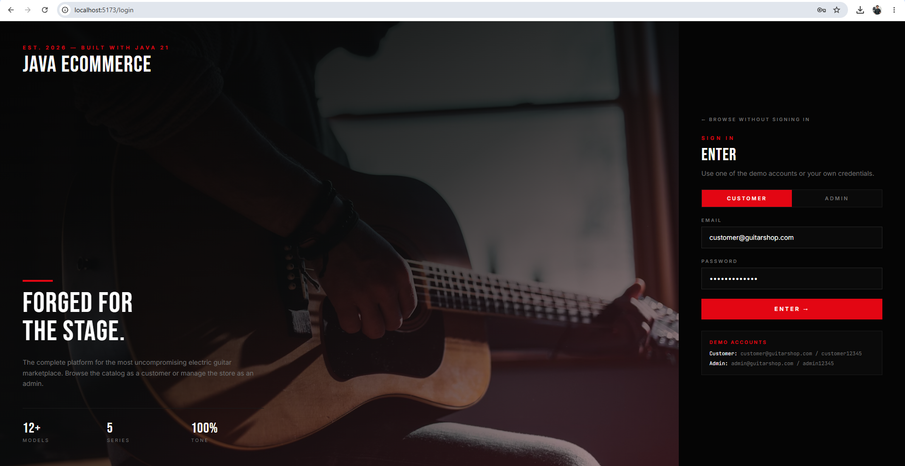
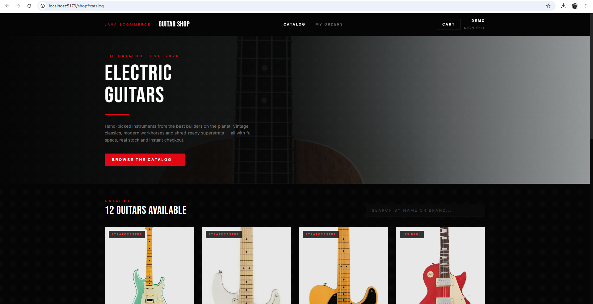
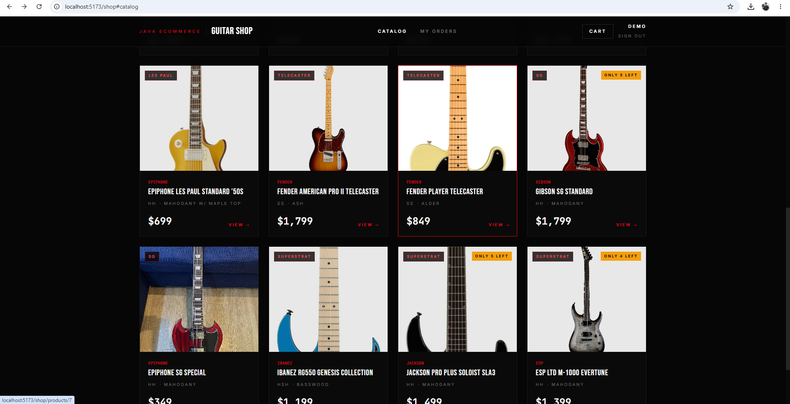
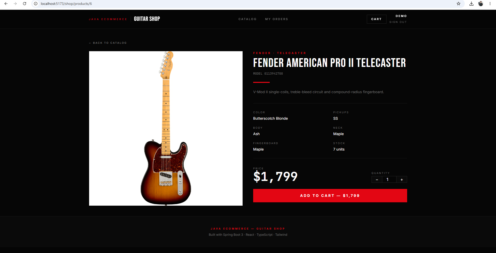
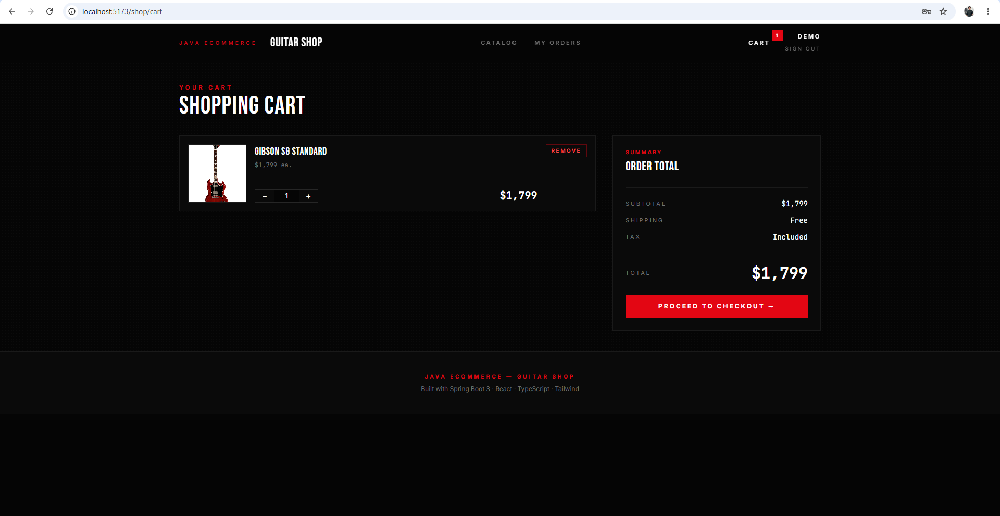
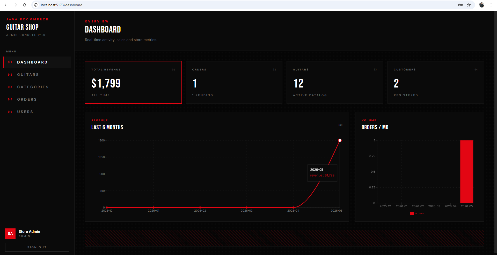
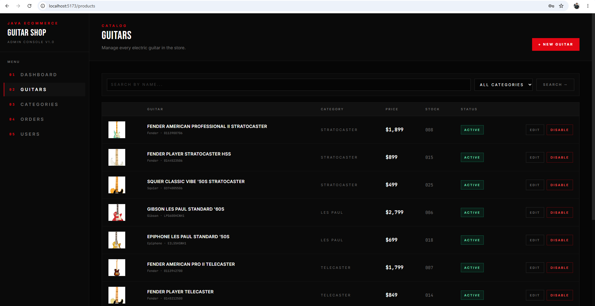
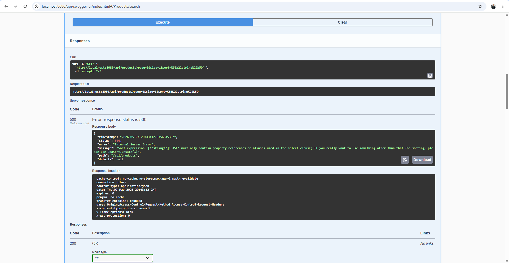

# 🎸 Java Ecommerce — Electric Guitar Shop


A full-stack e-commerce platform for selling **electric guitars online**, built as an end-to-end demonstration of **Java + OOP + Spring Boot 3** on the backend and **React + TypeScript** on the customer storefront and admin console.

The project covers the complete lifecycle of an online store: customer registration, JWT-protected authentication, a searchable guitar catalog, shopping cart, order management with a state machine, a customer-facing storefront, and a polished admin dashboard with sales charts.

> 🎬 **Quick demo:** see `docs/screenshots/00-demo.gif` for the end-to-end user flow.

---

## 📑 Table of Contents

- [Features](#-features)
- [Tech Stack](#-tech-stack)
- [Architecture & OOP](#-architecture--oop)
- [Project Structure](#-project-structure)
- [Quick Start (Docker)](#-quick-start-docker)
- [Manual Setup](#-manual-setup)
- [API Documentation](#-api-documentation)
- [Demo Credentials](#-demo-credentials)
- [Screenshots](#-screenshots)
- [REST Endpoints](#-rest-endpoints)
- [Domain Model](#-domain-model)

---

## ✨ Features

### Backend (Spring Boot 3 + Java 21)
- **JWT Authentication** with access + refresh tokens (jjwt 0.12)
- **Role-based authorization** — `ADMIN` and `CUSTOMER` with method-level `@PreAuthorize`
- **Product catalog** with search by name, category, min/max price + pagination
- **Shopping cart** per user with stock validation
- **Order workflow** with state machine: `PENDING → PROCESSING → SHIPPED → DELIVERED` (or `CANCELLED`)
- **Stock management** — automatic decrement on order, restock on cancel
- **Soft delete** for products
- **Global exception handler** with consistent JSON error responses
- **DTOs everywhere** — entities are never exposed
- **OpenAPI / Swagger UI** auto-generated at `/swagger-ui.html`
- **Bean Validation** (Jakarta) on all incoming requests
- **Auditing** — automatic `createdAt` / `updatedAt` via JPA Auditing
- **Optimistic locking** via `@Version` on `BaseEntity`
- **Data seeder** populates 5 categories + 12 real-world guitar models on first run

### Admin Dashboard (React + TypeScript)
- **JWT-aware Axios client** with automatic token refresh on `401`
- **Protected routes** with role check (admin-only)
- **Dashboard** with KPI cards + Recharts line/bar charts (last 6 months)
- **Products** — paginated table, search, category filter, modal CRUD with all guitar specs
- **Categories** — CRUD with image previews
- **Orders** — table view with valid next-status buttons (state-machine aware)
- **Users** — list of all registered customers and admins
- **Tailwind CSS** with custom brand palette
- **react-hot-toast** notifications

---

## 🛠 Tech Stack

| Layer    | Technology                                                |
|----------|-----------------------------------------------------------|
| Backend  | Java 21, Spring Boot 3.3, Spring Security, Spring Data JPA |
| DB       | PostgreSQL 16, Hibernate                                   |
| Auth     | JWT (jjwt 0.12), BCrypt                                    |
| Docs     | SpringDoc OpenAPI 2.6 (Swagger UI)                         |
| Build    | Maven 3.9                                                  |
| Frontend | React 18, TypeScript, Vite 5, Tailwind 3, React Router 6   |
| Charts   | Recharts 2                                                 |
| Infra    | Docker + Docker Compose                                    |

---

## 🏛 Architecture & OOP

This project was deliberately structured to **demonstrate Object-Oriented Programming** in real code, not just CRUD plumbing:

| OOP Concept       | Where it shows up                                                                           |
|-------------------|---------------------------------------------------------------------------------------------|
| **Inheritance**   | `BaseEntity` (abstract) → `User`, `Product`, `Category`, `Order`, `OrderItem`, `Cart`, `CartItem` |
| **Encapsulation** | DTOs hide entities. Domain logic lives in entities (`Product.decreaseStock`, `Cart.getTotal`)  |
| **Polymorphism**  | `User implements UserDetails` — Spring Security treats it polymorphically                    |
| **Abstraction**   | Repository interfaces extend `JpaRepository`, no implementation written                      |
| **Composition**   | `Cart` *has* a list of `CartItem`s; `Order` *has* a list of `OrderItem`s                     |
| **State pattern** | `OrderStatus` enum holds its own `canTransitionTo(...)` transition table                     |
| **Builder**       | All entities use Lombok `@Builder` for fluent construction                                   |
| **Custom exceptions** | `ResourceNotFoundException`, `BadRequestException`, `ConflictException` extend `RuntimeException` |

Layered architecture follows classic Spring conventions:

```
controller  →  service  →  repository  →  entity
     ↓
   DTO ↔ entity (via static factory methods)
```

---

## 📁 Project Structure

```
E-commerce/
├── backend/                          # Spring Boot Maven project
│   ├── pom.xml
│   ├── Dockerfile
│   └── src/main/
│       ├── java/com/javaecommerce/
│       │   ├── EcommerceApplication.java
│       │   ├── config/DataSeeder.java
│       │   ├── controller/          # REST endpoints
│       │   ├── service/             # business logic
│       │   ├── repository/          # Spring Data interfaces
│       │   ├── entity/              # JPA entities + BaseEntity
│       │   ├── dto/                 # request/response records
│       │   ├── security/            # JWT filter, config, services
│       │   └── exception/           # custom exceptions + global handler
│       └── resources/application.yml
│
├── frontend/                         # Vite + React + TS admin panel
│   ├── package.json
│   ├── Dockerfile  +  nginx.conf
│   └── src/
│       ├── main.tsx, App.tsx
│       ├── api/                     # axios client + endpoints
│       ├── context/AuthContext.tsx
│       ├── components/              # AdminLayout, DataTable, Modal, etc.
│       └── pages/                   # Login, Dashboard, Products, Orders, Users, Categories
│
├── docker-compose.yml                # Postgres + backend + frontend
├── .env.example
└── README.md
```

---

## 🚀 Quick Start (Docker)

The fastest way — everything (Postgres + API + UI) starts with one command.

### Prerequisites
- Docker Desktop 4+ (Windows / macOS / Linux)

### Run

```bash
# 1. Clone the repo
git clone <your-repo-url> java-ecommerce
cd java-ecommerce

# 2. Copy env template
cp .env.example .env

# 3. Start all services
docker compose up --build
```

Once everything is up:

| Service           | URL                                 |
|-------------------|-------------------------------------|
| Admin dashboard   | http://localhost:5173               |
| REST API          | http://localhost:8080/api           |
| Swagger UI        | http://localhost:8080/api/swagger-ui.html |
| PostgreSQL        | localhost:5432 (postgres/postgres)  |

The DataSeeder will automatically create:
- **2 demo users** (admin + customer — see [Demo Credentials](#-demo-credentials))
- **5 guitar categories** (Stratocaster, Les Paul, Telecaster, SG, Superstrat)
- **12 real guitar models** (Fender, Gibson, Epiphone, Squier, Ibanez, Jackson, ESP)

---

## 🔧 Manual Setup

If you prefer to run services manually (e.g. for development with hot reload).

### 1. PostgreSQL

```bash
# Create the database
psql -U postgres -c "CREATE DATABASE ecommerce_db;"
```

### 2. Backend

```bash
cd backend
cp .env.example .env   # adjust DB credentials if needed
./mvnw spring-boot:run
# or: mvn spring-boot:run
```

Backend listens on `http://localhost:8080/api`.

### 3. Frontend

```bash
cd frontend
cp .env.example .env
npm install
npm run dev
```

Vite dev server runs on `http://localhost:5173` and proxies `/api` to the backend.

---

## 📚 API Documentation

Once the backend is running, browse to:

**http://localhost:8080/api/swagger-ui.html**

You'll find every endpoint grouped by tag (Auth, Products, Categories, Cart, Orders, Users, Stats), with request/response schemas, validation rules, and "Try it out" support.

To test protected endpoints:
1. `POST /auth/login` with the demo admin credentials
2. Copy the returned `accessToken`
3. Click the **Authorize** button at the top of Swagger UI and paste the token

---

## 🔑 Demo Credentials

The DataSeeder creates these on first startup:

| Role     | Email                       | Password       |
|----------|-----------------------------|----------------|
| ADMIN    | `admin@guitarshop.com`      | `admin12345`   |
| CUSTOMER | `customer@guitarshop.com`   | `customer12345`|

---

## 📸 Screenshots

### End-to-end demo


### Login (Customer / Admin toggle)


### Storefront hero


### Catalog grid


### Product detail


### Shopping cart


### Admin dashboard with sales chart


### Admin product management


### Swagger UI


---

## 🌐 REST Endpoints

### Public
```
POST   /api/auth/register       Register a new customer
POST   /api/auth/login          Login → access + refresh tokens
POST   /api/auth/refresh        Exchange refresh token for new access token
GET    /api/products            Search & paginate guitars
GET    /api/products/{id}       Product detail
GET    /api/categories          List categories
GET    /api/categories/{id}     Category detail
```

### Authenticated (any user)
```
GET    /api/users/me            Current profile
PUT    /api/users/me            Update profile
GET    /api/cart                Get cart
POST   /api/cart/items          Add product to cart
PATCH  /api/cart/items/{id}     Update item quantity
DELETE /api/cart/items/{id}     Remove item
DELETE /api/cart                Clear cart
POST   /api/orders              Create order from cart
GET    /api/orders/me           My orders (paginated)
GET    /api/orders/{id}         Order detail (owner or admin)
```

### Admin only
```
POST   /api/products            Create guitar
PUT    /api/products/{id}       Update guitar
DELETE /api/products/{id}       Soft-delete guitar
POST   /api/categories          Create category
PUT    /api/categories/{id}     Update category
DELETE /api/categories/{id}     Delete category
GET    /api/orders              List all orders
PATCH  /api/orders/{id}/status  Update order status (state-machine validated)
GET    /api/users               List all users
GET    /api/users/{id}          User detail
GET    /api/admin/stats/dashboard   Aggregate dashboard metrics
```

---

## 🧬 Domain Model

```
User ──1:1── Cart ──1:N── CartItem ──N:1── Product ──N:1── Category
  │
  └──1:N── Order ──1:N── OrderItem ──N:1── Product
```

`Product` carries guitar-specific attributes: brand, model code, body wood, neck wood, fingerboard, pickup configuration (HH / SSS / HSS / HSH), color, and price.

`OrderItem` snapshots the product name and unit price at purchase time, so historical orders remain accurate even if the catalog is updated.

`OrderStatus` owns its own transition table (`canTransitionTo`), preventing invalid jumps like `DELIVERED → PENDING`.

---

## 🧪 Verifying it works

Quick sanity check from the command line:

```bash
# Login as admin
curl -X POST http://localhost:8080/api/auth/login \
  -H "Content-Type: application/json" \
  -d '{"email":"admin@guitarshop.com","password":"admin12345"}'

# Search guitars
curl "http://localhost:8080/api/products?name=strat&page=0&size=5"
```

---

## 📜 License

MIT — feel free to use this project as a portfolio reference.

## 👤 Author

Alan Toro — built to demonstrate full-stack Java + OOP + Spring Boot proficiency.
